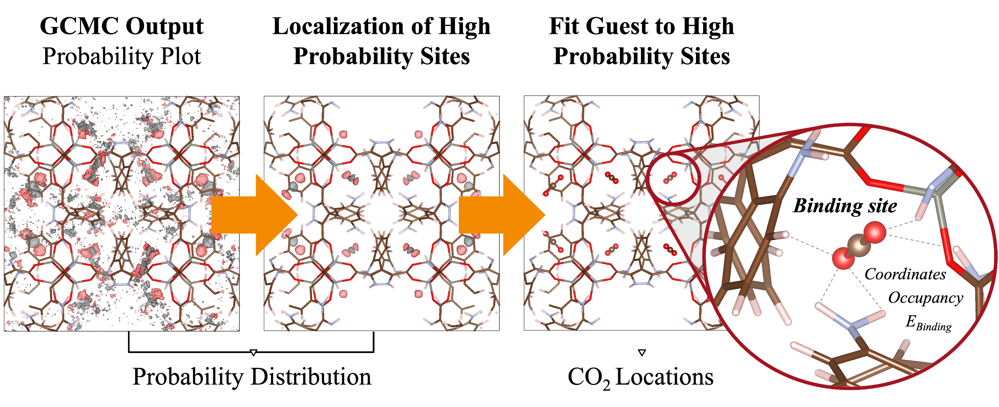

<a id="readme-top"></a>


[![Contributors][contributors-shield]][contributors-url]
[![Forks][forks-shield]][forks-url]
[![Stargazers][stars-shield]][stars-url]
[![Issues][issues-shield]][issues-url]

<br />
<div align="center">
  <a href="https://github.com/uowoolab/GALA2">
    
  </a>

<h3 align="center">Guest Atom Localization Algorithm (GALA)</h3>

  <p align="center">
    GALA is an automated tool that identifies and fits guest binding sites from GCMC probability distributions in porous materials.
    <br />
    <a href="https://github.com/uowoolab/GALA2/blob/main/HOWTOGALA.md"><strong>Explore the docs »</strong></a>
    <br />
    <br />
    <a href="https://github.com/uowoolab/GALA2/tree/main/Examples">View Demo</a>
    &middot;
    <a href="https://github.com/uowoolab/GALA2/issues/new?labels=bug&template=bug-report---.md">Report Bug</a>
    &middot;
    <a href="https://github.com/uowoolab/GALA2/issues/new?labels=enhancement&template=feature-request---.md">Request Feature</a>
  </p>
</div>

## About The Project



GALA is a binding site identification tool designed to extract chemically meaningful guest configurations from Grand Canonical Monte Carlo (GCMC) probability distributions in porous materials, such as metal-organic frameworks (MOFs). The algorithm analyzes atomic probability grids generated from GCMC simulations, applies Gaussian smoothing to reduce noise, and identifies high-probability regions as candidate binding sites. Using a reference molecular geometry, GALA fits the guest molecule to these sites via a recursive RMSD-based alignment procedure. Parameters such as occupancy cutoffs, exclusion radii, and the maximum number of sites are user-adjustable, making GALA flexible for a wide range of host-guest systems. The final configurations are suitable for downstream analysis, including force field energy minimization or quantum chemical calculations. GALA is scalable, fully automated, and compatible with multiple GCMC programs, including RASPA* and FastMC (https://github.com/uowoolab/FastMC-1.4.0), enabling high-throughput screening of adsorption sites across large materials databases.

**RASPA compatibility is not yet implemented, as we are waiting on RASPA developers to generate individual probability plots for each site in the guest molecule.*

<p align="right">(<a href="#readme-top">back to top</a>)</p>


## Getting Started

Ensure you have the following packages installed. The versions specified below are recommended to guarantee compatibility. *TESTED*

Python - 3.9.7\
numpy - 1.20.3\
pymatgen - 2023.8.10\
scipy - 1.7.1

You can install these packages using pip:

```bash
pip install numpy==1.20.3 pymatgen==2023.8.10 scipy==1.7.1
```

### Imported Modules and Packages
GALA imports the following modules and packages to execute its functions efficiently. The listed ones are either built-in or installed from the dependencies above.

Built-in:
```bash
os, itertools, shutil, subprocess, multiprocessing, time
```

### Installation

1. Clone the repo
    ```bash
    git clone https://github.com/uowoolab/GALA2.git
    ```
2. Install dependencies
    ```bash
    pip install numpy==1.20.3 pymatgen==2023.8.10 scipy==1.7.1
    ```
3. For easier access, users may want to make the GALA_main_FastMC.py and executable


<p align="right">(<a href="#readme-top">back to top</a>)</p>

## Usage
1. Prepare the input files as per the specifications using your prefered text editor.
    ```bash
    nano GALA.inp; vim GALA.inp; ...
    ```
2. Run the program using the command:
    ```bash
    python GALA_main.py
    ```
For more information on how to run GALA please refer to the [HOWTOGALA.md](https://github.com/uowoolab/GALA2/blob/main/HOWTOGALA.md) file.

<p align="right">(<a href="#readme-top">back to top</a>)</p>

## License

Distributed under the project_license. See `LICENSE.txt` for more information.

<p align="right">(<a href="#readme-top">back to top</a>)</p>

[contributors-shield]: https://img.shields.io/github/contributors/uowoolab/GALA2?style=for-the-badge
[contributors-url]: https://github.com/uowoolab/GALA2/graphs/contributors
[forks-shield]: https://img.shields.io/github/forks/uowoolab/GALA2.svg?style=for-the-badge
[forks-url]: https://github.com/uowoolab/GALA2/network/members
[stars-shield]: https://img.shields.io/github/stars/uowoolab/GALA2.svg?style=for-the-badge
[stars-url]: https://github.com/uowoolab/GALA2/stargazers
[issues-shield]: https://img.shields.io/github/issues/uowoolab/GALA2.svg?style=for-the-badge
[issues-url]: https://github.com/uowoolab/GALA2/issues
[license-shield]: https://img.shields.io/github/license/uowoolab/GALA2.svg?style=for-the-badge
[license-url]: https://github.com/uowoolab/GALA2/blob/master/LICENSE.txt
